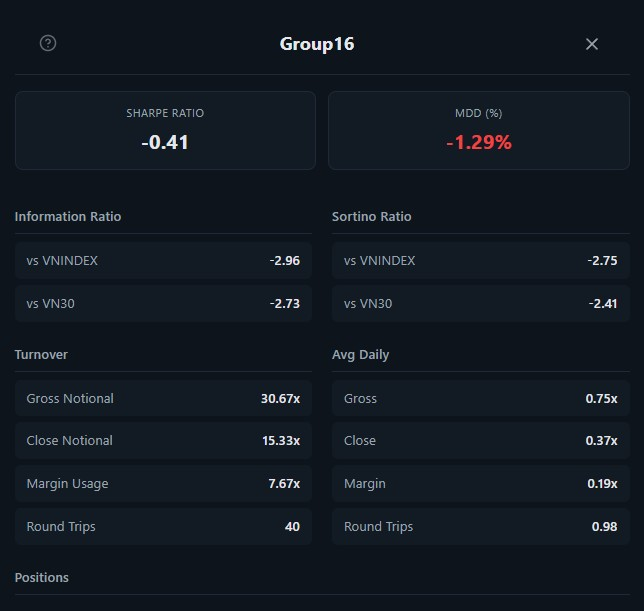

# Squeeze Breakout Auto-Trader

## Abstract

This project implements a live auto-trading strategy for Vietnam's derivative markets based on the **Squeeze Breakout** hypothesis. The strategy detects periods of volatility compression — where Bollinger Bands contract fully inside Keltner Channels — and enters a position on the first confirmed breakout candle, validated by directional momentum and a volume spike. Orders are executed in real-time via a FIX protocol connection through PaperBroker, with market data streamed over Kafka.

## Introduction

Trend-following strategies often struggle in choppy or transitioning markets where directional bias is unclear. The Squeeze Breakout strategy sidesteps this problem by focusing on a measurable structural condition: **volatility coiling**. When price action compresses into a narrow range, energy accumulates. The eventual breakout tends to be sharp and directional — making it a high-probability entry point if confirmed correctly.

Our implementation targets **VN30 futures contracts** (e.g. `VN30F2605`) traded on the Hanoi Stock Exchange derivatives market (HNXDS), where the T+0 settlement rule allows intraday long and short positions to be opened and closed freely within the same session.

The strategy runs on **1-minute OHLCV candles** built live from a streaming tick feed, applies three independent confirmation filters before entry, and manages exits through pre-calculated ATR-based take-profit and stop-loss levels.

## Related Work

Readers are recommended to review the following resources for background on the core indicators used:

- TTM Squeeze — John Carter: https://www.simplertrading.com/ttm-squeeze
- Bollinger Bands — John Bollinger: https://www.bollingerbands.com
- Keltner Channels — https://school.stockcharts.com/doku.php?id=technical_indicators:keltner_channels
- ATR — https://school.stockcharts.com/doku.php?id=technical_indicators:average_true_range_atr

## Trading Hypothesis

The strategy follows a three-gate entry logic, all of which must pass before a position is opened:

**Gate 1 — Squeeze detection**

A squeeze is active when Bollinger Bands (20-period, 2.0σ) are fully contained inside Keltner Channels (20-period SMA ± 1.5× ATR). This signals that volatility has compressed to an abnormally low level. The strategy latches a `_was_in_squeeze` flag the moment a squeeze is detected and holds it until an entry fires.

**Gate 2 — Squeeze release with directional momentum**

When the BB expands back outside the KC, the squeeze has released. At this point, the linear-regression slope of the last 12 closes determines direction. A positive slope with price breaking above the upper BB triggers a **LONG**; a negative slope with price breaking below the lower BB triggers a **SHORT**.

**Gate 3 — Volume confirmation**

A volume spike — defined as the latest bar's volume exceeding 1.5× the 20-bar average — must be present to confirm that real participation is behind the breakout and not a false expansion.

**Exit logic**

Take-profit and stop-loss levels are calculated at fill time and held fixed for the life of the trade:

```
take_profit = fill_price + (TP_ATR × ATR × side)
stop_loss   = fill_price − (SL_ATR × ATR × side)
```

A 3-bar cooldown is enforced after every trade closes to avoid immediately re-entering on residual momentum.

The figure below illustrates the full decision flow:

```
Tick feed
    │
    ▼
CandleBuilder (1-min OHLCV)
    │
    ▼
compute_squeeze()
    ├── in_squeeze?  ──► latch flag, wait
    └── squeeze released?
            ├── momentum confirms direction?
            └── volume spike present?
                    │
                    ▼
              place LIMIT order (FIX)
                    │
              TP / SL exit
```

## Data

The strategy consumes a **real-time Kafka tick feed** provided by PaperBroker. Each tick carries a matched price and cumulative matched quantity, which the `CandleBuilder` aggregates into 1-minute OHLCV bars. Completed candles are also appended to a local CSV file (`vn30_1m.csv`) for post-session review.

Configure your data source via environment variables in a `.env` file:

```
INSTRUMENT=HNXDS:VN30F2605
PAPERBROKER_ENV_ID=prod

PAPERBROKER_KAFKA_BOOTSTRAP_SERVERS=<host:port>
PAPERBROKER_KAFKA_USERNAME=<username>
PAPERBROKER_KAFKA_PASSWORD=<password>
```

## Implementation

**Requirements:** Python 3.10+

Install dependencies:

```bash
python -m venv venv
source venv/bin/activate        # Linux / macOS
.\venv\Scripts\activate.bat     # Windows

pip install -r requirements.txt
```

Configure your broker connection in `.env`:

```
PAPER_USERNAME=BL01
PAPER_PASSWORD=<password>
PAPER_ACCOUNT_ID_D1=D1
PAPER_REST_BASE_URL=http://localhost:9090
SOCKET_HOST=localhost
SOCKET_PORT=5001
SENDER_COMP_ID=cross-FIX
TARGET_COMP_ID=SERVER
```

Run the trader:

```bash
python live.py
```

## Strategy Parameters

Parameters are optimize using sample data from 2025-01-01 to 2026-02-28 :

```python
optimization:
  n_trials: 100

  bb_mult_range:      [1.5, 3.0]
  kc_mult_range:      [1.0, 2.5]
  vol_mult_range:     [1.2, 2.5]
  tp_atr_range:       [1.5, 4.0]
  sl_atr_range:       [0.5, 2.0]
  mom_period_range:   [6, 20]
  cooldown_bars_range: [1, 6]
```

## Architecture

The system is composed of five components across four logical layers, all wired together in `live()`.

```
 ┌───────────────────────────────────────────────────────────────────────┐
 │  MARKET DATA LAYER                                                    │
 │  KafkaMarketDataClient                                                │
 │  Subscribes to the instrument feed and fires on_quote() on each tick. │
 └────────────────────────────────┬──────────────────────────────────────┘
                                  │  on_quote(instrument, quote)
                                  ▼
 ┌───────────────────────────────────────────────────────────────────────┐
 │  PROCESSING LAYER                                                     │
 │  CandleBuilder                                                        │
 │  Accumulates ticks into 1-minute OHLCV bars. Returns a closed candle  │
 │  dict only when the minute rolls over; returns None otherwise.        │
 └──────────────────┬──────────────────────────────┬─────────────────────┘
                    │  closed candle               │  write candle
                    ▼                              ▼
 ┌──────────────────────────────┐    ┌─────────────────────────────────┐
 │  STRATEGY LAYER — Trader     │    │  STORAGE LAYER                  │
 │                              │    │  CandleCSVWriter                │
 │  1. compute_squeeze()        │    │  Appends each closed candle to  │
 │     BB vs KC → squeeze flag  │    │  vn30_1m.csv for later review.  │
 │     linreg slope → momentum  │    └─────────────────────────────────┘
 │     vol[-1] vs vol mean      │
 │                              │
 │  2. Entry gates (all 3 must  │
 │     pass before a trade):    │
 │     - squeeze latch set      │
 │     - squeeze released       │
 │     - volume spike present   │
 │     - momentum confirms dir  │
 │                              │
 │  3. Exit check (every bar):  │
 │     price vs pre-set TP / SL │
 └──────────────────┬───────────┘
                    │  place_order / close_order
                    ▼
 ┌───────────────────────────────────────────────────────────────────────┐
 │  EXECUTION LAYER                                                      │
 │                                                                       │
 │  OrderManager  (threading.Event bridge)                               │
 │  Holds two events — accepted and filled — that let the async Kafka    │
 │  callback thread block until the synchronous FIX thread signals       │
 │  completion. last_fill_price is stored here so the Trader can read    │
 │  the actual execution price before updating its internal state.       │
 │                                                                       │
 │  PaperBrokerClient  (FIX protocol)                                    │
 │  Sends LIMIT orders to the paper-trading server. Fires callbacks:     │
 │    fix:order:accepted  ->  OrderManager.accepted.set()                │
 │    fix:order:filled    ->  OrderManager.filled.set()                  │
 └───────────────────────────────────────────────────────────────────────┘
```

### Threading model

The system runs two concurrent execution contexts:

- **Async event loop** (`asyncio`) — drives `KafkaMarketDataClient`, fires `on_quote()` on each tick, calls `CandleBuilder.update()`, and invokes `Trader.on_candle()` when a minute closes.
- **FIX thread** (synchronous) — managed internally by `PaperBrokerClient`. Sends orders over the FIX socket and fires event callbacks (`fix:order:accepted`, `fix:order:filled`) back into the main thread.

`OrderManager` is the bridge. Before placing an order, the Trader calls `manager.accepted.wait(timeout=15)` and `manager.filled.wait(timeout=20)`. These calls block the current coroutine until the FIX callbacks fire `accepted.set()` and `filled.set()` respectively — or until the timeouts expire and the trade is aborted.

```
 Async loop (Kafka)          OrderManager          FIX thread
 ------------------          ------------          ----------
 place_order()  ─────────────────────────────────► send LIMIT
 wait(accepted) ◄── accepted.set() ◄── fix:accepted callback
 wait(filled)   ◄── filled.set()   ◄── fix:filled  callback
 update state   ────────────────────────────────────────────
```

This design keeps strategy state changes sequential and race-condition-free: position, entry price, TP, and SL are only written after a confirmed fill.

## Console Output

A typical session looks like:

```
🚀 FIX ready
📡 Subscribing to HNXDS:VN30F2605
🔥 Squeeze-Breakout trader running  (Ctrl-C to stop)

2026-05-04 09:15:00 | O:1285.0  H:1285.4  L:1284.6  C:1285.1  V:342
  🔵 SQ  mom=+0.0012  atr=1.84
  🔵 SQUEEZE active — coiling…

2026-05-04 09:16:00 | O:1285.1  H:1286.8  L:1285.0  C:1286.7  V:891
  ⭕  mom=+0.0041  atr=1.87  📊 VOL
  🟢 LONG breakout signal
  ↳ filled 3 @ 1286.7
  ✅ BUY 3 @ 1286.7 | TP=1290.44  SL=1284.83

2026-05-04 09:19:00 | O:1290.2  H:1290.6  L:1289.8  C:1290.5  V:504
  🎯 TP hit @ 1290.5
  💰 EXIT SELL @ 1290.5 | trade PnL: +11.40  total: +11.40  (1 trades)

📋 Session summary — trades: 1 | total PnL: +11.40
```

## Live trade result


## Reference

- PaperBroker documentation: https://paperbroker.io/docs
- Kafka Python client: https://kafka-python.readthedocs.io
- NumPy: https://numpy.org/doc
